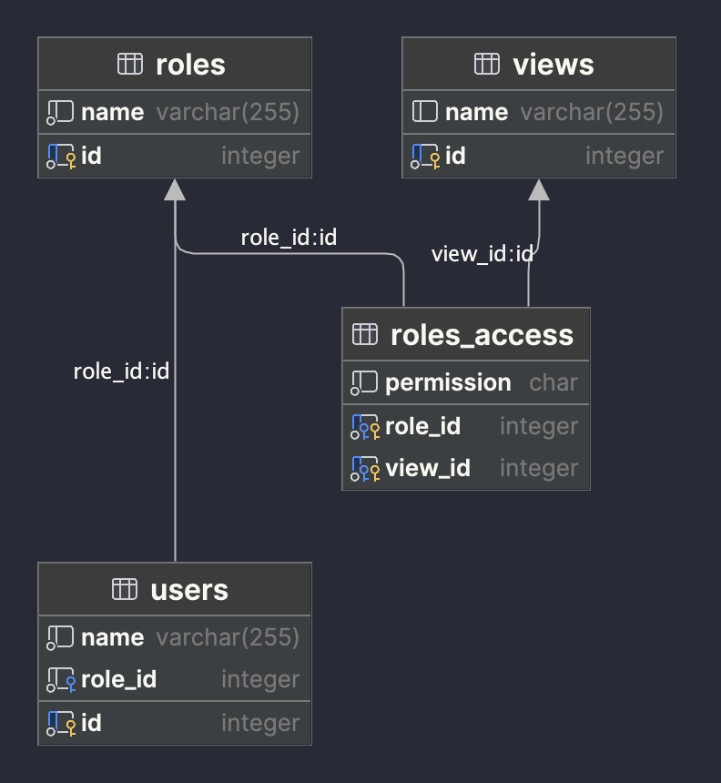

# Examen API

Prueba Técnica Node.js - V++

## Instrucciones

Objetivo General: Crea los métodos siguientes para que sea posible gestionar los usuarios y permisos del sistema:

### 1. Método GET: Obtener Usuarios y Permisos

#### Descripción:

Devuelve una lista de usuarios con las respectivas pantallas a las cuales puede acceder dependiendo de sus permisos.

#### Requisitos:

- Ordenar los resultados por nombre de usuario y nombre de pantalla.
- Incluir en la respuesta tanto el nombre de usuario como el nombre de pantalla asociado a cada permiso.

### 2. Método GET: Obtener Permisos por Usuario

#### Descripción:

Devuelve los permisos asociados a un usuario específico.

#### Requisitos:

- Utilizar el 'id' del usuario como parámetro de ruta.
- Devolver los permisos que correspondan al 'id' proporcionado.

### 3. Método POST: Agregar Permisos a un Usuario

#### Descripción:

Permite agregar uno o más permisos a un usuario.

#### Requisitos:

- Recibir un listado de pantallas como entrada.
- Validar que el usuario y las pantallas existan en la base de datos.
- Asegurar que el usuario no tenga previamente asignado el nuevo permiso.
- Proporcionar un mensaje de error o confirmación según sea el caso.

### 4. Método PUT: Actualizar Permiso de Usuario

#### Descripción:

Actualiza el permiso de un usuario para una pantalla específica.

#### Requisitos:

- Utilizar el 'id' de usuario como parámetro de ruta.
- Recibir el 'id' de pantalla y el nuevo permiso en el cuerpo de la solicitud.
- Validar que el usuario exista y tenga actualmente permiso para la pantalla especificada.
- Proporcionar un mensaje de confirmación o error después de la actualización.

### 5. Método DELETE: Eliminar Permiso de Pantalla del Usuario

#### Descripción:

Elimina una pantalla de los permisos de un usuario en específico.

#### Requisitos:

- Utilizar el 'id' de usuario y el 'id' de pantalla como parámetros en la solicitud.
- Validar que el usuario exista y tenga permiso para la pantalla especificada.
- Proporcionar una confirmación o mensaje de error tras la eliminación.

## Consideraciones generales

- Los métodos deberán estar creados bajo el endpoint '/permisos'
- Los valores posibles para permisos posibles son 'R' (Lectura) y 'W'(Escritura).
- Usuario -> Rol -> Permisos <- Pantallas
- El tipo de cuerpo de entrada deberá ser application/json.
- El tipo de cuerpo de salida podrá ser application/json o text/plain según aplique.

## Caso práctico:

Imagina que trabajas en el desarrollo de un Sistema de Gestión de Recursos Humanos (SGRH) para una empresa. Este sistema tiene varios módulos (pantallas), como Gestión de Empleados, Nóminas, Evaluaciones de Desempeño, y Administración de Beneficios.

### Usuarios y Permisos:

- Los usuarios del sistema son los empleados de la empresa, y cada uno tiene un rol específico (por ejemplo, Gerente de RRHH, Asistente de RRHH, Empleado Regular).
- Cada rol tiene permisos diferentes que determinan a qué módulos (pantallas) del sistema pueden acceder. Por ejemplo:
- Gerente de RRHH: Acceso a todos los módulos.
- Asistente de RRHH: Acceso a Gestión de Empleados y Nóminas, pero no a Evaluaciones de Desempeño.
- Empleado Regular: Acceso solo al módulo de Administración de Beneficios.

## Base de datos

### Diagrama

